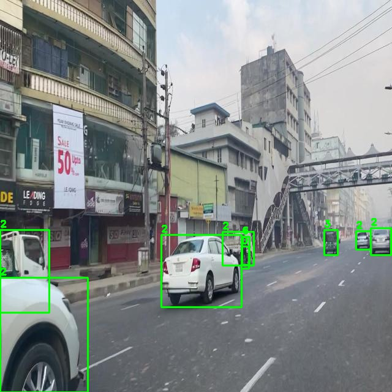
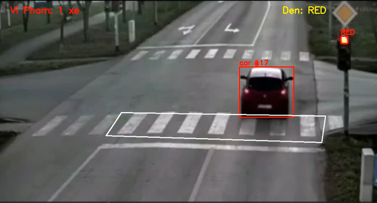
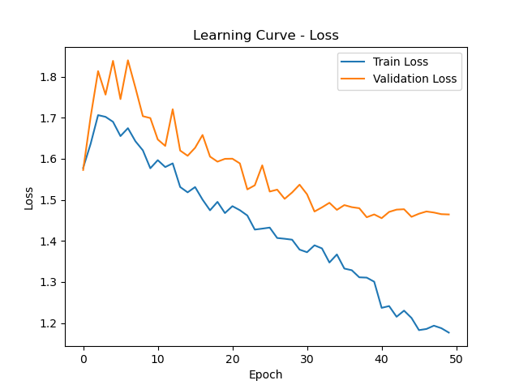
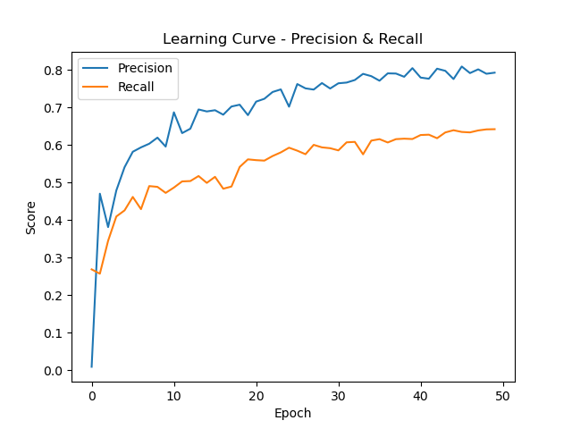

# 🚦 Hệ Thống Phát Hiện Vi Phạm Giao Thông

> Phát hiện xe vượt đèn đỏ tự động bằng **YOLOv10 + Custom Tracker + Phân tích đèn HSV**

---

## 📌 Demo

| Phát hiện xe | Xe vi phạm (đèn đỏ) |
|---|---|
|  |  |

---

## 🗂️ Cấu Trúc Project

```
traffic_violation/
├── main.py              # Pipeline chính
├── light.py             # Nhận diện đèn tín hiệu (HSV)
├── tracker.py           # Tracking xe theo ID
├── yolov10s.pt          # Model YOLO (tự động tải)
├── tr.mp4               # Video đầu vào
├── output/
│   ├── output.mp4       # Video kết quả
│   └── vi_pham/         # Ảnh chụp xe vi phạm
├── vehicle-detection/   # Dataset (nếu train lại)
│   ├── train/images/
│   ├── train/labels/
│   ├── valid/
│   ├── test/
│   └── data.yaml
├── so_do.ipynb          # EDA & phân tích dataset
└── train_xe.ipynb       # Huấn luyện model (Google Colab)
```

---

## ⚙️ Cài Đặt

**Yêu cầu:** Python 3.9–3.11

```bash
pip install ultralytics opencv-python numpy pandas matplotlib seaborn
```

Hoặc dùng `requirements.txt`:

```bash
pip install -r requirements.txt
```

<details>
<summary>Nội dung requirements.txt</summary>

```
ultralytics>=8.0.0
opencv-python>=4.8.0
numpy>=1.24.0
pandas>=2.0.0
matplotlib>=3.7.0
seaborn>=0.12.0
```

</details>

---

## 🚀 Chạy Chương Trình

### 1. Chuẩn bị

- Đặt file video vào thư mục gốc, đặt tên là `tr.mp4`
- Model `yolov10s.pt` sẽ **tự động tải** khi chạy lần đầu

### 2. Chạy

```bash
python main.py
```

### 3. Kết quả

| Output | Mô tả |
|---|---|
| `output/output.mp4` | Video đã xử lý với bounding box và trạng thái đèn |
| `output/vi_pham/*.jpg` | Ảnh chụp frame khi phát hiện vi phạm |
| Console | In `VI PHAM: car ID 5` mỗi khi có xe vi phạm |

> Nhấn **ESC** để dừng chương trình.

---

## 🔧 Cấu Hình

### Vùng kiểm soát vi phạm (`main.py`)

```python
area = [(324, 313), (283, 374), (854, 392), (864, 322)]
```

Tọa độ polygon trên frame **1020×600**. Dùng script sau để xác định tọa độ theo camera thực tế:

```python
import cv2
img = cv2.imread('frame_mau.jpg')
def click(event, x, y, flags, param):
    if event == cv2.EVENT_LBUTTONDOWN:
        print(f'({x}, {y})')
cv2.namedWindow('img')
cv2.setMouseCallback('img', click)
cv2.imshow('img', img); cv2.waitKey(0)
```

### Ngưỡng nhận diện đèn (`light.py`)

```python
mask_g = cv2.inRange(hsv, (58, 97, 222), (179, 255, 255))   # Xanh
mask_r = cv2.inRange(hsv, (0, 43, 184),  (56, 132, 255))    # Đỏ
```

Điều chỉnh giá trị HSV nếu camera có ánh sáng khác.

### Tracker (`tracker.py`)

```python
tracker = Tracker(max_dist=70, max_disappeared=15)
```

| Tham số | Ý nghĩa | Điều chỉnh khi |
|---|---|---|
| `max_dist` | Khoảng cách tối đa (px) để ghép ID | Xe di chuyển nhanh → tăng lên |
| `max_disappeared` | Số frame mất trước khi xóa ID | Xe hay bị che khuất → tăng lên |

---

## 🧠 Huấn Luyện Model (Tùy Chọn)

### Bước 1 — Phân tích dataset

Mở `so_do.ipynb` để kiểm tra dataset:

```
✅ Phân phối class
✅ Mẫu ảnh + bounding box
✅ Ma trận tương quan
✅ Kiểm tra label bị thiếu
✅ Thử augmentation (flip, rotate)
```

### Bước 2 — Train trên Google Colab

### 1 Chuẩn Bị Dataset

Cấu trúc dataset cần có dạng:

```
train_xe.zip
├── train/
│   ├── images/   # Ảnh huấn luyện (.jpg, .png)
│   └── labels/   # Nhãn YOLO format (.txt)
├── valid/
│   ├── images/
│   └── labels/
└── test/
    ├── images/
    └── labels/
```

Mỗi file nhãn `.txt` theo định dạng YOLO:
```
<class_id> <x_center> <y_center> <width> <height>
```

### 2 Upload Dataset Lên Google Drive

Nén toàn bộ dataset thành file `train_xe.zip` và upload vào:
```
Google Drive > My Drive > Colab Notebooks > train_xe.zip
```

Mở `train_xe.ipynb` trên Colab, chạy tuần tự:

```python
# 1. Cài thư viện
!pip install ultralytics

# 2. Mount Drive và giải nén dataset
from google.colab import drive
drive.mount('/content/drive')
!unzip /content/drive/MyDrive/.../train_xe.zip -d /content/dataset

# 3. Tạo data.yaml (đã có sẵn trong notebook)

# 4. Train
!yolo detect train data=/content/dataset/data.yaml model=yolov10n.pt epochs=50 imgsz=640

# 5. Tải model về
from google.colab import files
files.download('/content/runs/detect/train2/weights/best.pt')
```

### Bước 3 — Dùng model vừa train

```bash
# Đặt best.pt vào thư mục gốc, đổi tên
mv best.pt xe.pt
```

Sửa dòng trong `main.py`:

```python
model = YOLO("xe.pt")   # thay vì yolov10s.pt
```

### Kết quả huấn luyện (50 epochs)

| Metric | Train | Validation |
|---|---|---|
| Precision | ~0.82 | ~0.80 |
| Recall | ~0.67 | ~0.65 |
| Box Loss | ~1.18 | ~1.47 |

<details>
<summary>Xem learning curves</summary>

**Loss Curve**



**Precision & Recall**



</details>

---

## 🧪 Đánh Giá Model

### Test nhanh một ảnh

```python
from ultralytics import YOLO
model = YOLO('xe.pt')
results = model.predict('test_image.jpg', conf=0.4, save=True)
```

### Đánh giá trên tập test

```python
from ultralytics import YOLO
model = YOLO('xe.pt')

results = model.val(
    data='vehicle-detection/data.yaml',
    split='test',
    conf=0.3,
    single_cls=True   # Fix lỗi mismatch class
)

print(f"Precision : {results.box.mp:.3f}")
print(f"Recall    : {results.box.mr:.3f}")
print(f"mAP50     : {results.box.map50:.3f}")
print(f"mAP50-95  : {results.box.map:.3f}")
```

> ⚠️ Dùng `single_cls=True` khi model chỉ có 1 class nhưng `data.yaml` có nhiều class.

---

## 🏗️ Kiến Trúc Hệ Thống

```
Video Input (tr.mp4)
        │
        ▼
┌───────────────┐     ┌─────────────────┐
│   light.py    │     │   YOLOv10       │
│  (HSV color)  │     │  (Detection)    │
│  → GREEN/RED  │     │  → bboxes       │
└──────┬────────┘     └────────┬────────┘
       │                       │
       └──────────┬────────────┘
                  ▼
         ┌────────────────┐
         │   tracker.py   │
         │  (ID tracking) │
         └────────┬───────┘
                  │
                  ▼
        ┌─────────────────┐
        │  Vi phạm check  │
        │  inside area    │
        │  + light == RED │
        └────────┬────────┘
                 │
        ┌────────┴────────┐
        │                 │
   Lưu ảnh          Ghi video
  vi_pham/         output.mp4
```


## 📋 Checklist Chạy Nhanh

```
[ ] pip install ultralytics opencv-python numpy
[ ] Đặt video tr.mp4 vào thư mục gốc
[ ] python main.py
[ ] Xem output/output.mp4
[ ] Xem ảnh vi phạm trong output/vi_pham/
```